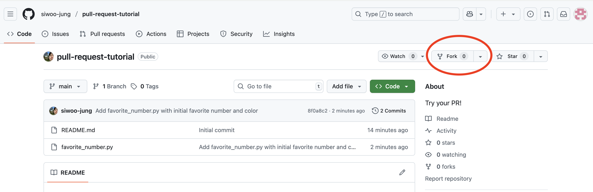
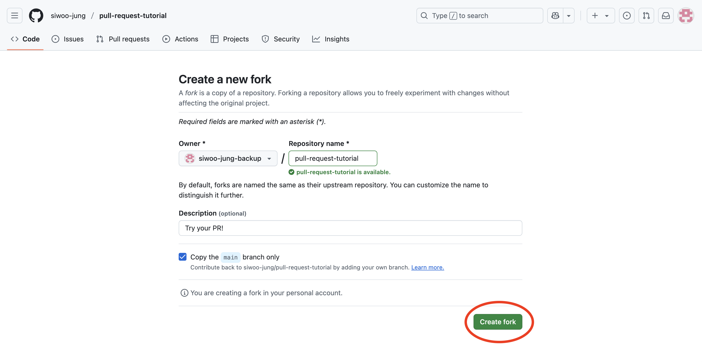
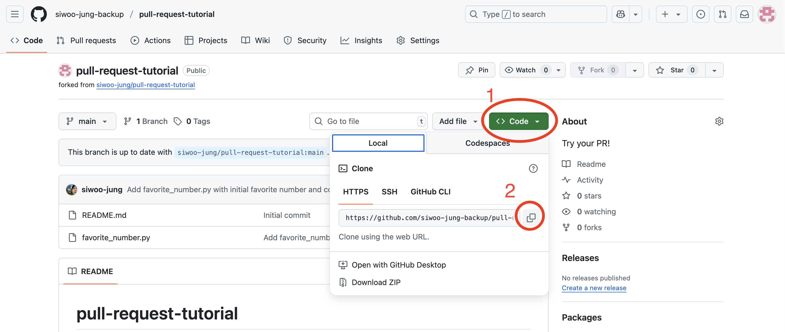
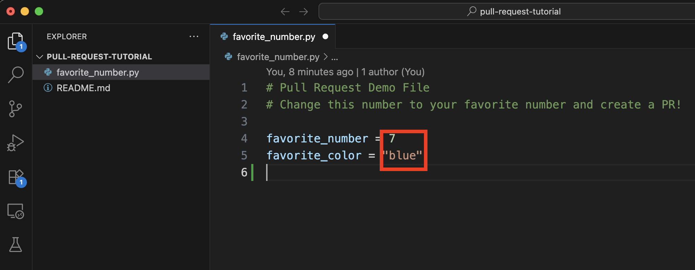
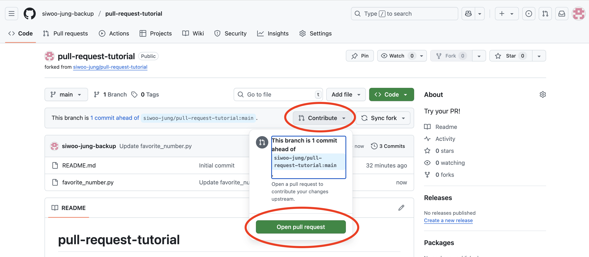
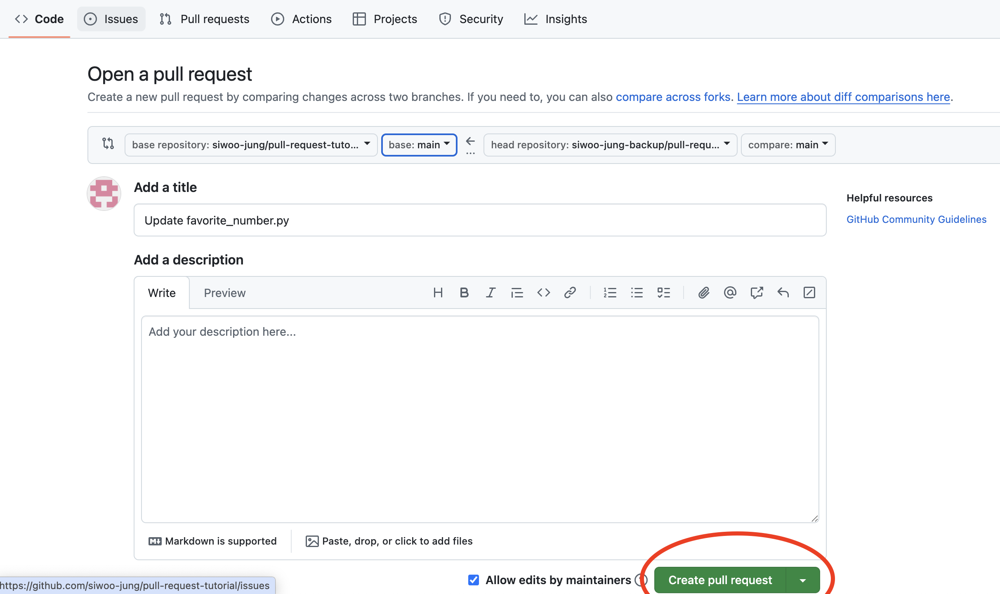
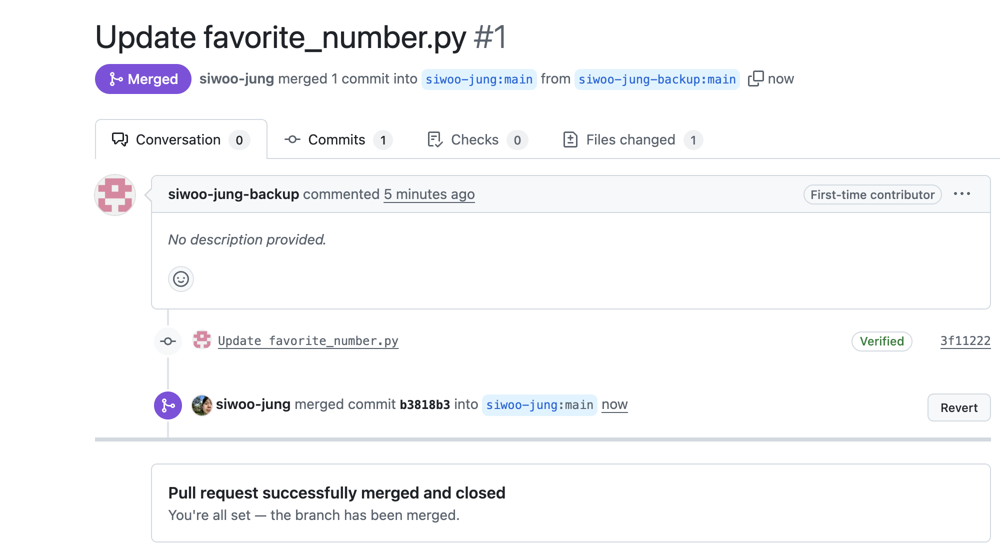

# Pull Request Tutorial 🚀

Welcome to your first pull request tutorial! This repository is designed to help you learn the basics of contributing to open source projects through GitHub pull requests.

## 🎯 What You'll Learn

By following this tutorial, you'll learn how to:
- Fork a repository
- Clone a repository to your local machine
- Make changes to files
- Commit and push changes
- Create a pull request
- Understand the pull request workflow

## 📝 How to Participate

### Step 1: Fork the Repository

1. Navigate to the top right of this repository page
2. Click the **Fork** button
3. Click **Create fork** to fork this repository to your GitHub account

   
   

### Step 2: Get Your Repository URL

1. Click the **<> Code** button (green button)
2. Click the copy icon to copy your repository URL

   

### Step 3: Clone the Repository

Open your terminal and run the following commands. **Make sure to replace `YOUR-USERNAME` with your actual GitHub username:** or use the copied url from Step 2.

```bash
git clone https://github.com/YOUR-USERNAME/pull-request-tutorial.git
cd pull-request-tutorial
```

### Step 4: Make Your Changes

1. Open the `favorite_number.py` file in your preferred text editor
2. Change the `favorite_number` and `favorite_color` variables to your actual favorites
3. Save the file

   

### Step 5: Commit and Push Your Changes

Run these commands in your terminal:

```bash
git add favorite_number.py
git commit -m "Update favorite number and color"
git push origin main
```

### Step 6: Create a Pull Request

1. Go to your forked repository on GitHub
2. Click the **Contribute** button
3. Click **Open pull request**

   

### Step 7: Submit Your Pull Request

1. Review your changes on the pull request page
2. Click **Create pull request**

   

### Step 8: Wait for Review

Once you submit your pull request, I will review it and merge it into the main branch!

    
    
---

**Thank you for participating! 🎉**

*Happy coding and contributing to open source!*
